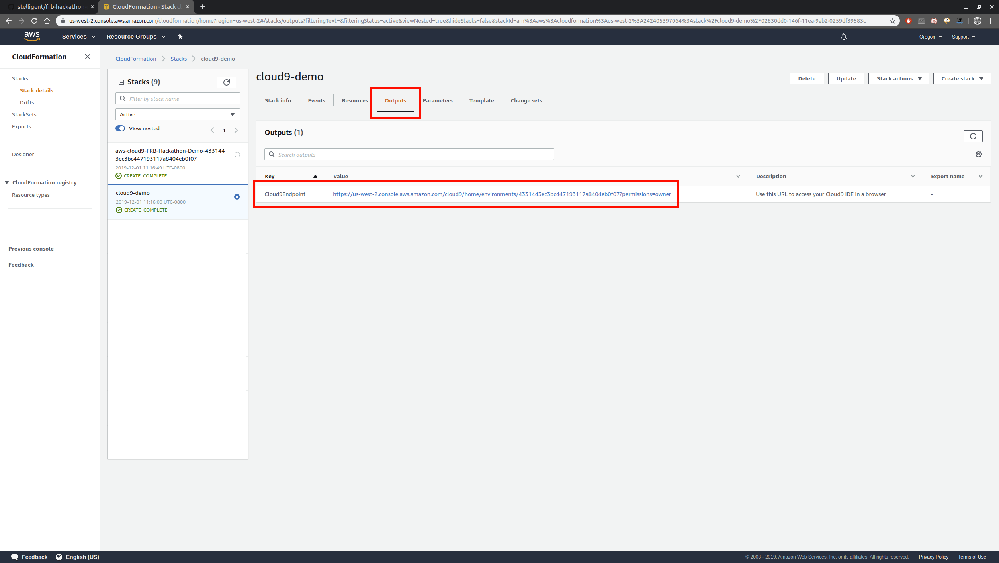
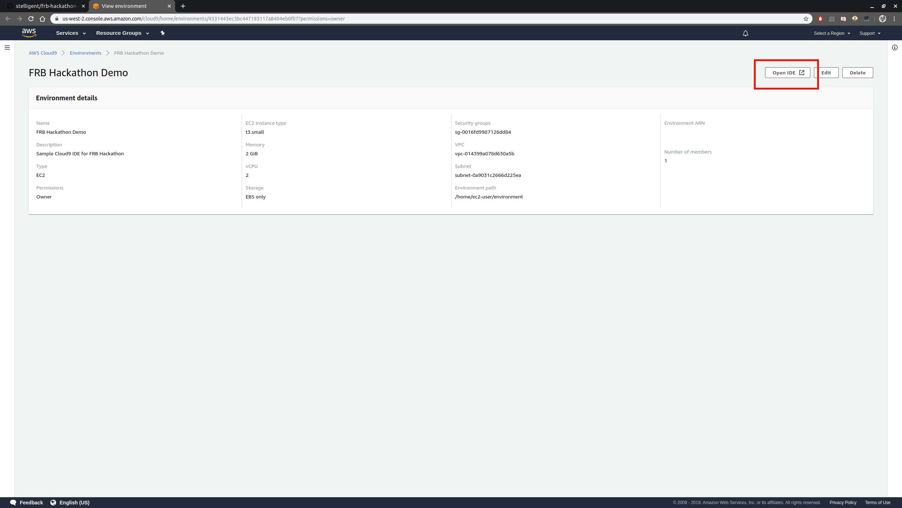

# frb-hackathon

this is a resource dump of FRB hackathon webinars

## in this repo...

### `12_3_2019 Webinar - Building Apps in AWS`

Recording of the AWS Primer webinar presented on 12/3/2019

### `12_5_2019 Webinar - ML Apps using AWS API`

Recording of the AWS ML webinar presented on 12/5/2019 + its data files

### `cloud9-cfn.yml`

A sample CloudFormation file for you so you can deploy a basic Cloud9 IDE setup in your own AWS account.

- Stack has only one output and that's a link to your deployed IDE.
- Once deployed through CloudFormation, open _Cloud9Endpoint_ output in your browser and click _Open IDE_.
- Consult CloudFormation documentation on how to deploy the IDE with this YAML file.

### `cloud9-cdk.js`

A CDK stack that generates `cloud9-cfn.yml`. If you prefer CDK, you may use this code, otherwise skip it.

- Stack was written with a developer preview version of Cloud9 CDK module, things might change later.
- Consult AWS CDK documentation on how to deploy the IDE with this JS file.
